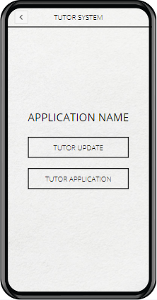
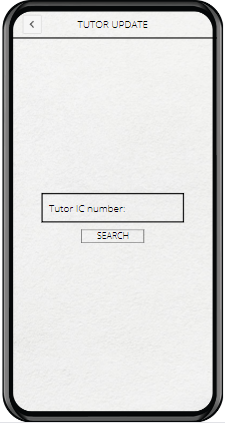
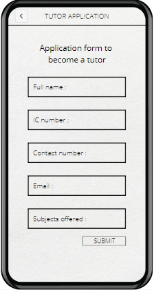
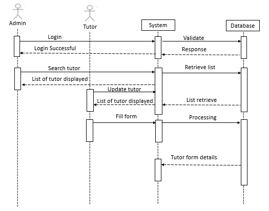

## Tutoring Management for Secondary School Student

### Name and Matric Number of the Group Members
    1. Yasmin Hana binti Zulkifli 1914198
    2. Nur Aisyah Syahirah binti Osman 1819266

### Introduction
    Our application is a platform to display the tutors that teach secondary school subjects. Users apply 
    for the position by filling in the form provided in the application. If approved as tutors, their 
    details will be saved in the database. The only details that will be displayed in the application are 
    the tutor's name, subjects offered and the tutor's contact number. Students can view these 
    informations for the desired tutor's services. 

### Objectives
    1. To provide tutors that teaches secondary school subjects
    2. To help tutors make pocket money

### Features and Functionalities
    1. CRUD functions
    2. Admin login
    3. Form for tutors information details
    4. Camera feature for tutor form
    
### Screen navigation (routing) and widgets (UI and reusable widget) implementation

	

### Sequence diagram

